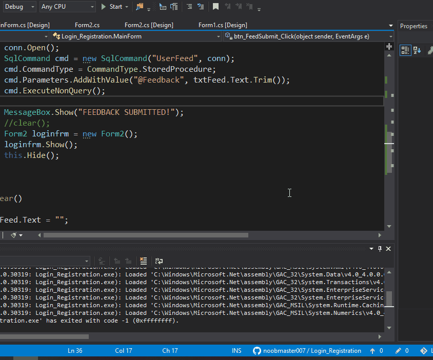

# LoginRegisterFeedback App
**Prerequisite** 
1. Download SQL Server (Express Edition).
link - https://go.microsoft.com/fwlink/?linkid=866658 
2. Download SQL Server Management Studio.
link - https://aka.ms/ssmsfullsetup

**This is how it Works**

This is just a Prototype of Feedback Form. I have designed the app in such  a way that each fresh user **Register** first then **login** then he/she will give a **Feedback**,

But the **Drawback** is that the same existing person keep repeatedly write Feedback. which is not supposed to be happen.
