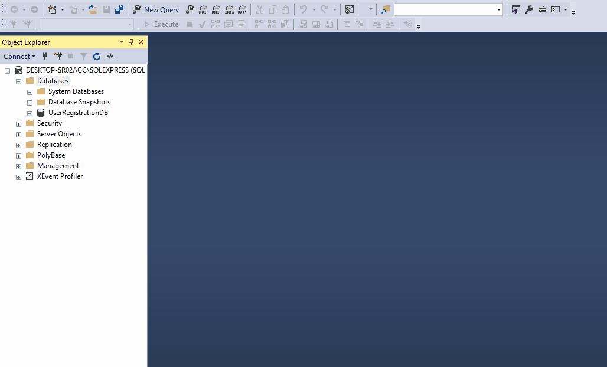

# Welcome
**Prerequisite** 
1. Download SQL Server (Express Edition).
link - https://go.microsoft.com/fwlink/?linkid=866658 
2. Download SQL Server Management Studio.
link - https://aka.ms/ssmsfullsetup

**How to set the database to the existing application?**

Follow the steps: 
1. Open SQL Server Management Studio->Connect the Server-> Create database.

